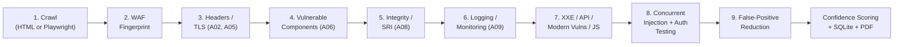
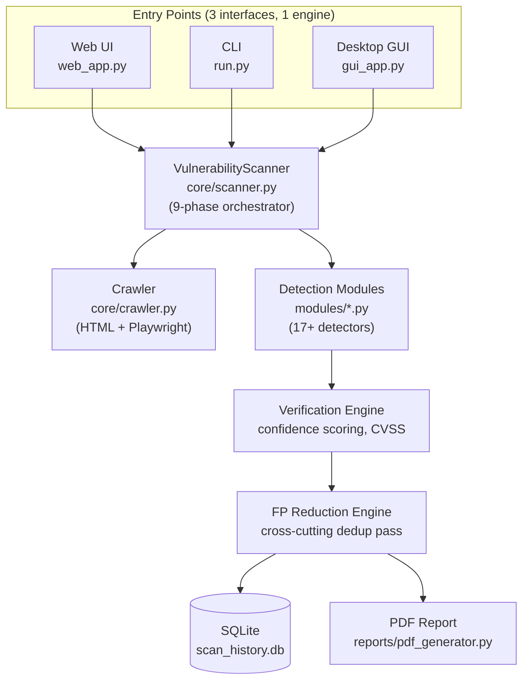

<div align="center">

# 🔒 Web Application Vulnerability Scanner

### An OWASP Top 10-Aligned Scanner with Confidence-Scored Findings and PDF Reporting

[](https://www.python.org/)
[](https://flask.palletsprojects.com/)
[](#-license)
[-red.svg)](https://owasp.org/Top10/)
[](#-running-tests)
[](#-contributing)

A Python-based web application scanner that crawls a target site and tests it against detectors mapped to the 10 OWASP Top 10 (2025) categories, then produces a PDF report with confidence-scored findings. Built as a learning project to understand how automated security scanning actually works under the hood.

[Screenshots](#-screenshots--demo) • [Features](#-features) • [Installation](#-installation) • [Usage](#-usage) • [Limitations](#-limitations--manual-verification) • [Architecture](#-architecture)

</div>

---

> ⚠️ **Legal Notice — Read Before Use**
> Only scan applications you **own** or have **explicit written permission** to test. Unauthorized scanning of third-party systems is illegal in most jurisdictions (e.g. under the U.S. CFAA, UK Computer Misuse Act, and similar laws elsewhere). You are solely responsible for how you use this tool.

---

## 📋 Table of Contents

- [Screenshots & Demo](#-screenshots--demo)
- [Why This Project](#-why-this-project)
- [Tech Stack](#-tech-stack)
- [Features](#-features)
- [OWASP Top 10 Coverage](#️-owasp-top-10-coverage)
- [Installation](#-installation)
- [Usage](#-usage)
- [Scan Modules](#-scan-modules)
- [How a Scan Works](#-how-a-scan-works)
- [Example Output](#-example-output)
- [Performance Notes](#-performance-notes)
- [Limitations & Manual Verification](#-limitations--manual-verification)
- [Output & Reports](#-output--reports)
- [Scan History](#-scan-history)
- [Deployment](#-deployment)
- [Architecture](#-architecture)
- [Project Structure](#-project-structure)
- [Running Tests](#-running-tests)
- [Roadmap](#-roadmap)
- [Contributing](#-contributing)
- [Demo Target](#-demo-target)
- [License](#-license)
- [Disclaimer](#️-disclaimer)

---

## 📸 Screenshots & Demo

<!--
  Add real screenshots/GIF before pushing — this section is a placeholder.
  Suggested shots: the scan-start form, the live progress view, the results
  page, and a page of the generated PDF report.

  Recommended tools for the GIF: ScreenToGif (Windows), Kap (macOS),
  peek (Linux), or LICEcap (cross-platform). Keep it under ~10MB and
  trim it to ~15-20 seconds — just enough to show a scan running end to end.

  Once you have the files, drop them in a /docs/screenshots folder in the
  repo and swap the paths below.
-->

| Scan Form | |
|---|---|
|  |  |

| Results Page | PDF Report |
|---|---|
|  | ![PDF report screenshot] |


---

## 💡 Why This Project

Manually testing a web app against the OWASP Top 10 takes time and security expertise. This project is my attempt to automate a **first pass** of that process and, more importantly, to actually understand how each piece of a scanner works — crawling, payload injection, evidence collection, confidence scoring, and reporting — rather than treating an existing tool as a black box.

It is **not** a replacement for a professional penetration test or a mature commercial/open-source scanner (Burp Suite, OWASP ZAP, Nessus, etc.). See [Limitations](#-limitations--manual-verification) for specifics.

It ships with three interchangeable front-ends — **Web UI**, **CLI**, and **Desktop GUI** — all driven by the same scanning engine underneath.

---

## 🛠 Tech Stack

| Layer | Technology | Role |
|---|---|---|
| **Language** | Python 3.9+ | Core implementation |
| **HTTP client** | `requests` | Sending crawl/test requests |
| **HTML parsing** | `BeautifulSoup4`, `lxml` | Extracting links, forms, inputs |
| **Browser automation** | `Playwright` (optional) | JS-rendered SPA crawling + real XSS execution proof |
| **Web framework** | `Flask` | Web UI backend & routes |
| **Rate limiting** | `Flask-Limiter` | Throttling scan requests on the web UI |
| **Concurrency** | `ThreadPoolExecutor` (stdlib) | Parallel URL/parameter testing |
| **Database** | `SQLite3` (stdlib) | Scan history persistence |
| **PDF generation** | `ReportLab` | Report rendering |
| **Desktop UI** | `customtkinter` | Native GUI front-end |
| **External scanner (optional)** | `python-owasp-zap-v2.4` | OWASP ZAP passthrough integration |
| **OOB verification (optional)** | Interactsh client | Proof-of-exploitation callbacks for blind vulns |
| **Testing** | `pytest`, `responses` | Unit tests with mocked HTTP |
| **Deployment** | `gunicorn`, Render (`render.yaml`) | Production WSGI server & hosting config |

---

## ✨ Features

| Feature | Description |
|---|---|
| **OWASP Top 10-mapped detectors** | Detectors aligned to all 10 OWASP 2021 categories (A01–A10) — see [coverage notes](#️-owasp-top-10-coverage) for what "coverage" actually means here |
| **17+ Detection Modules** | SQLi, XSS, CSRF, SSRF, XXE, IDOR, Directory Traversal, Broken Auth, Vulnerable Components, Security Headers, SRI, Logging Failures, Open Redirect, Blind Command Injection, API Security checks, SSTI/NoSQLi, JS static analysis |
| **Confidence scoring** | Each finding gets a 0–100 confidence score and a label (Confirmed / Likely / Potential / Informational) instead of a flat yes/no — intended to help you triage, not to guarantee accuracy |
| **False-positive reduction pass** | A final cross-cutting pass looks for systemic patterns (e.g. the same "admin panel" text appearing on many unrelated URLs) that a single detector working in isolation can't see |
| **SPA-aware crawling** | Detects React/Vue/Angular signals and can switch to a Playwright headless-browser crawler for JS-rendered routes |
| **Optional browser-based XSS verification** | Runs candidate payloads in a real headless browser when Playwright/Chromium is installed; falls back to reflection-only detection (capped confidence) otherwise |
| **Optional OOB verification** | Interactsh-based callbacks give stronger evidence for blind SSRF/XXE/command-injection classes when a server is configured |
| **Concurrent scanning** | Multi-threaded URL/parameter testing |
| **Authenticated scanning** | Cookie, Bearer token, HTTP Basic auth, and simulated form-login support |
| **WAF fingerprinting** | Best-effort detection of common WAFs, with alternate payload encodings tried when initial probes appear blocked |
| **Automatable business-logic checks** | A handful of *structurally detectable* logic flaws (price/quantity manipulation, workflow bypass, mass assignment) — true business-logic testing still requires a human who understands the app |
| **PDF reports** | Executive summary, OWASP breakdown, per-finding evidence and remediation notes |
| **Scan history** | SQLite-persisted, browsable from the Web UI |
| **3 interfaces, 1 engine** | Web UI, CLI, and Desktop GUI all call the same scanning engine |
| **Optional OWASP ZAP integration** | Passthrough to a running ZAP instance for its active-scan engine |

---

## 🛡️ OWASP Top 10 Coverage

> **What "coverage" means here:** each category below has at least one detector that tests for common patterns in that class. This is **heuristic, black-box coverage** — it is not exhaustive, and a category being listed does not mean every possible vulnerability in that class will be found. Treat this as a starting point for triage, not a certification.

| # | OWASP Category | Scanner Module(s) | Notes |
|---|---|---|---|
| A01 | Broken Access Control | `idor_detector.py` | Tests numeric/UUID substitution; won't catch access-control flaws that require understanding app-specific roles |
| A02 | Cryptographic Failures | `security_headers_detector.py` | Checks HTTPS/HSTS presence only — not a TLS configuration audit (use `testssl.sh`/`sslyze` for that) |
| A03 | Injection | `sqli_detector.py`, `xss_detector.py`, `xxe_detector.py`, `directory_traversal_detector.py`, `blind_cmdi_detector.py` | Signature/timing-based; blind and second-order variants are harder to catch reliably |
| A04 | Insecure Design | `csrf_detector.py`, `open_redirect_detector.py`, `business_logic_detector.py` | Business logic checks cover 4 known structural patterns only |
| A05 | Security Misconfiguration | `security_headers_detector.py` | Header/cookie checks; does not cover server/infra misconfiguration outside HTTP responses |
| A06 | Vulnerable & Outdated Components | `vulnerable_components_detector.py` | Depends on the OSV.dev API being reachable; falls back to a smaller built-in table otherwise |
| A07 | Identification & Auth Failures | `broken_auth_detector.py`, `rate_limit_detector.py` | Default-credential and lockout checks; not a full auth/session security review |
| A08 | Software & Data Integrity Failures | `sri_detector.py` | Checks for missing SRI attributes and a few exposed files; not a supply-chain audit |
| A09 | Security Logging & Monitoring Failures | `logging_detector.py` | Can only observe externally visible signals (debug pages, exposed panels) — can't inspect actual server-side logging config |
| A10 | Server-Side Request Forgery | `ssrf_detector.py` | Strongest confidence when OOB (Interactsh) verification is configured; response-only detection is weaker evidence |

Beyond the classic 10: **API Security** (BOLA, CORS, JWT-adjacent checks), **SSTI / NoSQL injection**, and **static JS analysis** for dangerous sinks and hardcoded secrets.

---

## 🚀 Installation

### Requirements
- Python 3.9+
- pip

### Steps

```bash
# 1. Clone the repository
git clone https://github.com/Himanshu230806/web-vuln-scanner.git
cd web-vuln-scanner

# 2. (Recommended) create a virtual environment
python3 -m venv venv
source venv/bin/activate        # Windows: venv\Scripts\activate

# 3. Install dependencies
pip install -r requirements.txt

# 4. (Optional) install the headless browser for SPA crawling + XSS verification
python -m playwright install --with-deps chromium

# 5. (Optional) install test dependencies
pip install responses pytest
```

### Core Dependencies

```
flask>=3.0.0
flask-limiter>=3.5.0
requests>=2.31.0
beautifulsoup4>=4.12.0
lxml>=4.9.3
reportlab>=4.0.0
colorama>=0.4.6
gunicorn>=21.2.0
playwright>=1.40.0
python-owasp-zap-v2.4
```

---

## 📖 Usage

### Web UI

```bash
python web_app.py
```

Open your browser at **http://localhost:5000**

The UI lets you enter a target URL, choose which modules to run, add auth credentials, watch live progress, view results, download the PDF, and browse scan history.

### Command Line

```bash
# Basic scan
python run.py -u https://target.com

# Deeper crawl, more threads
python run.py -u https://target.com -d 5 -t 20

# Only specific modules
python run.py -u https://target.com --modules sqli,xss,security_headers,ssrf

# Force headless-browser crawler (JS-heavy SPA)
python run.py -u https://target.com --browser-crawl

# With OWASP ZAP active scan
python run.py -u https://target.com --zap

# Verbose output
python run.py -u https://target.com -v
```

**Key CLI options:**

| Flag | Description |
|---|---|
| `-u, --url` | Target URL (required) |
| `-d, --depth` | Crawl depth (default: 3) |
| `-t, --threads` | Worker threads (default: 10) |
| `--modules` | Comma-separated module list |
| `--browser-crawl` | Force the Playwright headless-browser crawler |
| `--zap` | Enable OWASP ZAP integration |
| `--interactsh-server` | Custom Interactsh server for OOB verification |
| `--no-browser-verify` | Disable real-browser XSS execution proof |
| `--no-pdf` | Skip PDF report generation |
| `-o, --output` | Output PDF file path |
| `--no-verify-ssl` | Disable TLS certificate verification |
| `--auth-cookie / --auth-header / --auth-basic` | Authenticated scanning (see below) |

Run `python run.py --help` for the full list.

### Desktop GUI

```bash
pip install customtkinter
python gui_app.py
```

Uses the same engine, database, and PDF generator as the CLI and Web UI — no scanning logic is duplicated.

### Authenticated Scanning

```bash
# Cookie-based session
python run.py -u https://app.com --auth-cookie "session=abc123xyz"

# Bearer token (JWT / OAuth)
python run.py -u https://api.com --auth-header "Authorization: Bearer eyJhbGci..."

# HTTP Basic auth
python run.py -u https://staging.com --auth-basic admin:password123

# Simulated login form
python run.py -u https://app.com --auth-url https://app.com/login --auth-user admin --auth-pass secret
```

---

## 🧩 Scan Modules

### A01 — Broken Access Control
`modules/idor_detector.py` — increments/substitutes numeric and UUID parameters and path segments, flags when a different ID returns a significantly different 200 response.

### A02 — Cryptographic Failures
`modules/security_headers_detector.py` — flags plain-HTTP pages and missing HSTS.

### A03 — Injection
`sqli_detector.py`, `xss_detector.py`, `xxe_detector.py`, `directory_traversal_detector.py`, `blind_cmdi_detector.py` — error/boolean/time-based SQLi, reflected/stored XSS (with optional browser verification), XML external entity payloads, path traversal sequences, and time/OOB-based blind command injection.

### A04 — Insecure Design
`csrf_detector.py`, `open_redirect_detector.py`, `business_logic_detector.py` — missing CSRF tokens, unvalidated redirect parameters, and a small set of structurally detectable logic flaws.

### A05 — Security Misconfiguration
`modules/security_headers_detector.py` — CSP, X-Frame-Options, X-Content-Type-Options, Referrer-Policy, Permissions-Policy, exposed version headers, cookie flags.

### A06 — Vulnerable & Outdated Components
`modules/vulnerable_components_detector.py` — server/library version fingerprinting cross-referenced against OSV.dev (with a local fallback table), exposed manifest files, CMS detection.

### A07 — Identification & Authentication Failures
`broken_auth_detector.py`, `rate_limit_detector.py` — default-credential probing, missing account lockout, session token exposure/weakness checks.

### A08 — Software & Data Integrity Failures
`modules/sri_detector.py` — missing Subresource Integrity attributes, exposed `.env`/`.git` files, dangerous JS patterns.

### A09 — Security Logging & Monitoring Failures
`modules/logging_detector.py` — verbose error/debug pages, unauthenticated admin panels, directory listing, sensitive data in responses.

### A10 — Server-Side Request Forgery
`modules/ssrf_detector.py` — cloud metadata and loopback address probes, strengthened by OOB verification when configured.

### Beyond the classic 10
`api_security_detector.py` (OWASP API Top 10), `modern_vuln_detector.py` (SSTI, NoSQLi, clickjacking), `js_analyzer.py` (context-aware static JS analysis).

---

## ⚙️ How a Scan Works



---

## 🖥 Example Output

**Console (CLI), abbreviated:**

```
╔══════════════════════════════════════════════════════════════╗
║       Web Application Vulnerability Scanner v5.0             ║
║          Full OWASP Top 10 Coverage Edition                   ║
╚══════════════════════════════════════════════════════════════╝
Target : https://example-test-site.com
Modules: 17 active detectors — OWASP A01–A10

[*] Phase 1: Crawling target...
[+] Discovered 42 URLs
[!] High: Cross-Site Scripting (XSS) [A03 – Injection] (Likely 72%) — https://example-test-site.com/search?q= [param: q]
[!] Medium: Security Header Missing [A05 – Security Misconfiguration] — https://example-test-site.com/

╔══════════════════════════════════════════════════════════════╗
║                     SCAN SUMMARY                              ║
╚══════════════════════════════════════════════════════════════╝
Target     : https://example-test-site.com
URLs       : 42
Forms      : 6
Parameters : 19

FINDINGS: 11
  Critical : 1
  High     : 3
  Medium   : 4
  Low       : 2
  Info      : 1
```

**Sample findings currently in `output/`:** the repo includes real PDF reports generated against a local test target (e.g. `scan_e5df05e1_20260717_085537.pdf`) — open one of these to see the actual report layout rather than a mockup.

---

## ⏱ Performance Notes

Scan duration depends heavily on: crawl depth (`-d`), number of discovered URLs/forms/parameters, thread count (`-t`), the per-request `--delay`, whether the Playwright browser crawler is engaged (slower than the plain HTML crawler), and whether OOB/browser-based verification is enabled (adds a wait per candidate finding).

No fixed benchmark numbers are published here because they vary too much by target size and network conditions to be meaningful out of context. If you want to include real numbers in your own copy of this README, a simple way to generate them:

```bash
time python run.py -u https://your-test-target.com -d 3 -t 10
```

Run it a few times against a target you control and report the average duration, URLs crawled, and findings count.

---

## ⚠️ Limitations & Manual Verification

This is an automated, largely black-box scanner. It is **not** a substitute for manual penetration testing or code review. Specific limitations to be aware of:


- **Business logic testing is intentionally narrow.** Only 4 structurally detectable patterns (price/quantity manipulation, workflow bypass, mass assignment) are automated — most business-logic flaws require a human who understands the application's intended behavior.
- **Coverage depends on what the crawler can reach.** Pages behind complex multi-step flows, CAPTCHAs, or auth flows the scanner can't simulate will not be tested. `--browser-crawl` helps with JS-rendered content but is not a guarantee of full coverage.
- **XSS execution verification requires Playwright/Chromium.** Without it, XSS findings are reflection-only and capped at a lower confidence — they still need manual confirmation in a real browser.
- **Component/CVE lookups depend on external services.** The OSV.dev lookup requires network access to that API; if it's unreachable, the scanner falls back to a smaller built-in signature table and may miss recently disclosed CVEs.
- **WAF and rate-limit detection are heuristic and timing-sensitive.** Results can vary between runs and environments (network latency, target load).
- **TLS/crypto checks are surface-level.** Only presence of HTTPS/HSTS is checked from response headers — this is not a substitute for a dedicated TLS configuration scan (e.g. `testssl.sh`).
- **This tool can generate load and malicious-looking traffic against the target.** Only run it against systems you own or are authorized to test, and consider running it against a staging environment rather than production.

**Recommended workflow:** use this tool to get a fast first pass and a prioritized list of leads, then manually verify each "Confirmed"/"Likely" finding (and spot-check "Potential" ones) before including it in any report you share externally.

---

## 📊 Output & Reports

After every scan, a PDF report is generated in the `output/` folder containing an executive summary, an OWASP Top 10 breakdown, per-finding details (type, severity, confidence, URL, parameter, evidence, description), remediation suggestions, and scan statistics (URLs crawled, forms tested, parameters tested, duration).

**Severity levels:**

| Level | Meaning |
|---|---|
| 🔴 Critical | Suggests immediate exploitation may be possible (e.g. SQLi, SSRF to metadata endpoint) — verify manually before treating as confirmed |
| 🟠 High | Serious risk if confirmed (e.g. XSS, IDOR, broken auth) |
| 🟡 Medium | Significant risk (e.g. CSRF, open redirect, missing headers) |
| 🟢 Low | Lower risk (e.g. info disclosure, missing SRI) |
| 🔵 Info | Informational only (e.g. CMS/version detected) |

**Confidence classification:** each finding is labeled **Confirmed**, **Likely**, **Potential**, or **Informational** based on a 0–100 score — use this to prioritize manual review, not as a final verdict.

---

## 📋 Scan History

All scan results are persisted in a local SQLite database (`scan_history.db`), browsable at **http://localhost:5000/history**, and survive app restarts.

---


### Environment Variables (optional)

| Variable | Description | Default |
|---|---|---|
| `DB_PATH` | Path to the SQLite DB file | project root |
| `PORT` | Port to listen on | `5000` |
| `ZAP_API_KEY` | OWASP ZAP API key if using ZAP integration | — |
| `LOGS_DIR` | Directory for scanner logs | `logs/` |
| `OUTPUT_DIR` | Directory for generated PDF reports | `output/` |

---

## 🏗️ Architecture



---

## 📁 Project Structure

```
web-vuln-scanner/
├── web_app.py                          ← Flask web UI (routes, history, live progress via SSE)
├── run.py                              ← CLI entry point
├── gui_app.py                          ← Desktop GUI (customtkinter)
├── db.py                               ← SQLite persistence layer
├── env_loader.py                       ← Zero-dependency .env loader
│
├── core/
│   ├── scanner.py                      ← Main orchestrator (all 9 scan phases)
│   ├── crawler.py                      ← HTML crawler + Playwright SPA crawler
│   └── scan_runner.py                  ← Progress-tracking wrapper shared by CLI/GUI
│
├── modules/                            ← 17+ detector modules + supporting engines
│   ├── sqli_detector.py                ← A03 SQL Injection
│   ├── xss_detector.py                 ← A03 XSS
│   ├── xxe_detector.py                 ← A03 XXE
│   ├── directory_traversal_detector.py ← A03 Directory Traversal
│   ├── blind_cmdi_detector.py          ← A03 Blind Command Injection
│   ├── csrf_detector.py                ← A04 CSRF
│   ├── open_redirect_detector.py       ← A04 Open Redirect
│   ├── business_logic_detector.py      ← A04 Business Logic Flaws
│   ├── security_headers_detector.py    ← A02 + A05 Headers
│   ├── vulnerable_components_detector.py ← A06 Components
│   ├── broken_auth_detector.py         ← A07 Auth Failures
│   ├── rate_limit_detector.py          ← A07 Rate Limiting / Enumeration
│   ├── sri_detector.py                 ← A08 Integrity
│   ├── logging_detector.py             ← A09 Logging Failures
│   ├── idor_detector.py                ← A01 IDOR
│   ├── ssrf_detector.py                ← A10 SSRF
│   ├── api_security_detector.py        ← OWASP API Top 10
│   ├── modern_vuln_detector.py         ← SSTI, NoSQLi, Clickjacking
│   ├── js_analyzer.py                  ← Static JS security analysis
│   ├── waf_detector.py                 ← WAF fingerprinting + bypass
│   ├── verification_engine.py          ← Confidence scoring, CVSS estimate
│   ├── fp_reduction_engine.py          ← Centralized false-positive reduction
│   ├── auth_handler.py                 ← Login/session handling
│   ├── browser_xss_verifier.py         ← Real-browser XSS execution proof
│   ├── interactsh_client.py            ← Out-of-band verification
│   ├── passive_scanner.py              ← Zero-request secret/version scanning
│   ├── smart_targeter.py               ← Skips irrelevant tests per parameter
│   ├── spa_detector.py                 ← Detects React/Vue/Angular apps
│   └── zap_integration.py              ← OWASP ZAP bridge
│
├── reports/
│   └── pdf_generator.py                ← PDF report generator (ReportLab)
│
├── config/
│   └── settings.py                     ← Scanner configuration & defaults
│
├── utils/
│   ├── payloads.py                     ← Centralized attack payload database
│   └── helpers.py                      ← Shared utility functions
│
├── tests/
│   ├── test_detectors.py               ← Unit tests (mocked HTTP via `responses`)
│   └── test_vulnerable_app.py          ← Tests against a deliberately vulnerable app
│
├── output/                             ← Generated PDF reports
├── logs/                               ← Scanner logs
├── requirements.txt
└── render.yaml                         ← Render deployment config
```

---

## 🧪 Running Tests

```bash
python -m pytest tests/test_detectors.py -v
python -m pytest tests/test_detectors.py::TestSQLiDetector -v

pip install pytest-cov
python -m pytest tests/ --cov=modules --cov-report=term-missing
```

All tests use the `responses` mock library — no real HTTP requests are made during testing.

---

## 🗺️ Roadmap

- [ ] Docker image for one-command deployment
- [ ] JSON/CSV export alongside PDF
- [ ] Real benchmark numbers from repeated runs against a fixed test target
- [ ] CI pipeline (GitHub Actions) running the test suite on every PR
- [ ] GraphQL-specific test module

---

## 🤝 Contributing

1. Fork the repository
2. Create a feature branch (`git checkout -b feature/my-detector`)
3. Add tests for any new detector under `tests/`
4. Make sure `python -m pytest tests/ -v` passes
5. Open a pull request describing what you changed and why

If adding a new detector, follow the existing pattern in `modules/` — return a list of finding dicts with `type`, `url`, `severity`, `description`, and `evidence` keys (see `verification_engine.py` for the full expected shape).

---

## 🔧 Demo Target

Use **VulnBank** — a deliberately vulnerable demo app built to exercise every scanner module:

```bash
git clone https://github.com/Himanshu230806/vulnbank.git
cd vulnbank
pip install -r requirements.txt
python app.py
# Runs at http://localhost:8080
```

```bash
python run.py -u http://localhost:8080 -d 3
```

---

## 📄 License

Licensed under the [MIT License](LICENSE) — free to use, modify, and distribute, provided the original copyright notice is retained.

---

## ⚠️ Disclaimer

This tool is intended **strictly for educational purposes** and authorized security testing only. The author(s) are not responsible for any misuse. Always obtain written permission before scanning any system you do not own.

---

<div align="center">

**Built as a hands-on exploration of how automated web application security scanning works — from crawling to confidence-scored reporting.**

If this project was useful to you, consider giving it a ⭐

</div>
